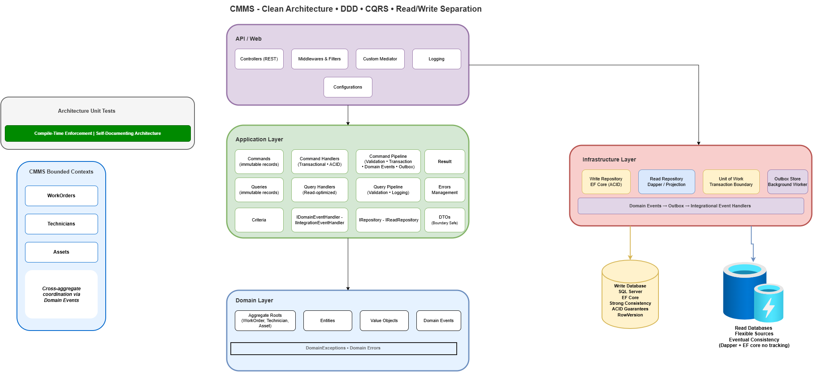
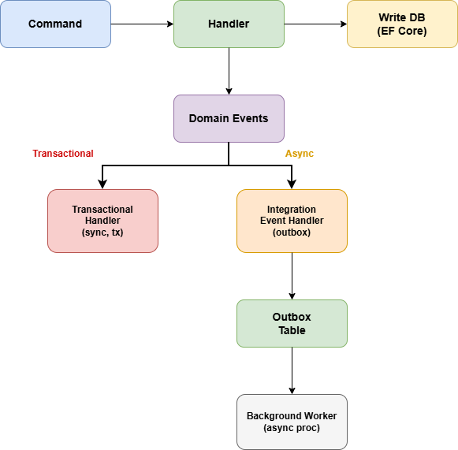
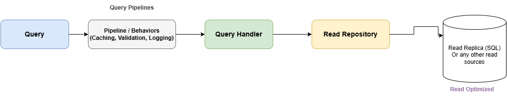
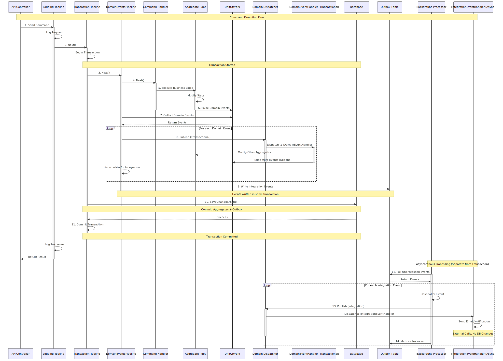

# Clean Architecture CMMS: DDD + CQRS with Architecture Tests and Automated Boundary Enforcement


A .NET 8 application demonstrating Clean Architecture, Domain-Driven Design (DDD), and CQRS with automated architecture tests, integration tests, and event-driven cross-aggregate coordination. This template provides a solid foundation for building maintainable, testable, and scalable applications.

## Introduction

This application implements a **Computerized Maintenance Management System (CMMS)** - a domain that manages work orders, asset maintenance, and technician assignments. The CMMS domain is perfect for demonstrating .NET CQRS DDD patterns because it has:

- **Clear business boundaries** (Work Orders, Technicians, Assets)
- **Complex business rules** (assignment constraints, status transitions)
- **Rich domain models** with encapsulated behavior
- **Real-world scenarios** that teams can relate to

### CMMS Domain Context

A CMMS system manages maintenance operations for organizations:

- **Assets** represent equipment, machinery, or facilities that require maintenance
- **Work Orders** track maintenance tasks, repairs, or inspections needed for assets
- **Technicians** are skilled workers who perform the maintenance work
- **Assignments** connect technicians to work orders based on skills and availability

The system handles the complete maintenance lifecycle: from creating work orders when issues are reported, to assigning qualified technicians, tracking progress, and completing the work.

## Philosophy

This application demonstrates that implementing .NET CQRS DDD doesn't have to be complex. It shows how to apply DDD and CQRS pragmatically in .NET - with enough structure to maintain boundaries and enable testing, but without over-engineering or speculative abstractions.

**Perfect for:**
- Teams building enterprise .NET applications with CQRS and DDD
- Developers learning how to implement .NET CQRS DDD patterns
- Architects evaluating .NET CQRS DDD implementations

### Design Principles

- **Domain-First Design** - Business logic lives in the domain, not in services
- **Explicit Boundaries** - Each layer has a clear purpose and dependency rules
- **Testability by Design** - Every component can be tested in isolation
- **Pragmatic CQRS** - Separate read/write models where it adds value
- **Architectural Governance** - Automated tests prevent boundary violations


## Key Features Overview

This application includes implementations of enterprise patterns:

### Core Architecture
- Clean Architecture layers with dependency inversion
- DDD tactical patterns (Aggregates, Entities, Value Objects, Domain Events)
- CQRS: EF Core for writes, flexible read sources (Dapper, read replicas, Redis, Elasticsearch)
- Repository pattern with Unit of Work
- Custom Mediator: No MediatR dependency, full control over CQRS pipeline

### Event-Driven Architecture
- **Dual Event Handlers**: `IDomainEventHandler` (transactional) + `IIntegrationEventHandler` (async)
- **Outbox Pattern**: Guaranteed event delivery with at-least-once semantics
- **Cross-aggregate coordination** via domain events (per ADR-001)

### Reliability & Consistency
- Optimistic concurrency control with SQL Server RowVersion
- Result pattern for consistent error handling
- Pipeline behaviors (Validation, Transaction, Logging, Events)
- Structured error export API for frontend localization

### Quality & Documentation
- **Architecture unit tests**: automated tests enforcing DDD/Clean Architecture
- **ADRs**: Documented architectural decisions — see [Architectural Decision Records](docs/architectural-decisions/)
- **Unit tests** for Domain & Application layers
- **OpenAPI** with versioning
- **Integration tests**: Testcontainers-based end-to-end scenarios 

## Architecture Overview



### CQRS Flow with Events

**Write Path (Commands):**



Shows a write path from command through handler, domain events, transactional handlers, integration event handlers, outbox pattern, and background worker.

**Read Path (Queries):**



Shows the flexible read path supporting multiple data sources (Read Replica, Redis Cache, Elasticsearch, Dapper) with eventual consistency.

**Command Sequence Diagram:**



## Core Patterns Explained

### CQRS Implementation

This Dotnet CQRS implementation separates read and write operations for optimal performance and scalability.

**Write Side (Commands):**
- Uses EF Core with change tracking and transactions
- Implements `IRepository<T>` with Unit of Work pattern
- Strong consistency with ACID guarantees
- RowVersion for optimistic concurrency
- Business rules enforced in domain aggregates
- Transactional consistency required

**Read Side (Queries):**
- **Flexible data sources** - not limited to a single technology
- Current implementation: Dapper for fast SQL queries
- Can use: Read replicas, Redis cache, Elasticsearch, NoSQL stores
- **Eventually consistent** - does not require transactional consistency
- No change tracking overhead
- Optimized for throughput and scalability
- Horizontal scaling friendly

**Key Principles:**
- Write and read models never cross paths - prevents accidental coupling
- Architecture tests enforce separation (queries cannot use `IRepository`, commands cannot use `IReadRepository`)
- Read side can be optimized independently based on query patterns

### Event-Driven Architecture

The template implements a dual event handler system with guaranteed delivery via the Outbox Pattern.

#### IDomainEventHandler (Transactional Events)

**Characteristics:**
- Executes within the same transaction
- Modifies aggregate state via repositories
- Changes committed atomically with the command
- Failure causes transaction rollback

**Use Cases:**
- Cross-aggregate state synchronization
- Business rule enforcement across aggregates
- Critical operations requiring ACID guarantees

**Example:**
```csharp
// WorkOrder created → Asset must be set to "Under Maintenance"
public class WorkOrderCreatedEventHandler : IDomainEventHandler<WorkOrderCreatedEvent>
{
    public async Task Handle(WorkOrderCreatedEvent @event, CancellationToken ct)
    {
        var asset = await _assetRepository.GetByIdAsync(@event.AssetId, ct);
        asset.SetUnderMaintenance(); // Saved in same transaction
    }
}
```

#### IIntegrationEventHandler (Asynchronous Events)

**Characteristics:**
- Executes via Outbox Pattern (outside the command scoped)
- Written to outbox table in same transaction as command
- Background processor handles delivery
- Guaranteed delivery with automatic retry
- Survives application restarts

**Use Cases:**
- Sending notifications (email, SMS, push)
- Publishing to message bus for external systems
- Logging and auditing
- Analytics and reporting

**Example:**
```csharp
// WorkOrder completed → Send notification email
public class EmailWorkOrderCompletedHandler : IIntegrationEventHandler<WorkOrderCompletedEvent>
{
    public async Task Handle(WorkOrderCompletedEvent @event, CancellationToken ct)
    {
        await _emailService.SendCompletionNotification(@event.WorkOrderId);
        // Email failure won't rollback work order completion
    }
}
```

#### Outbox Pattern Implementation

**Current Implementation (Simple):**
The current implementation uses a simple, in-process approach:
- EF Core-based `EfCoreOutboxStore` implements `IOutboxStore` abstraction
- In-process event handlers via background worker
- SQL Server database table for persistence
- Straightforward polling-based processor

**How It Works:**
1. Integration events written to `Outbox` table within command's transaction
2. Background processor polls outbox for unprocessed events
3. Processor deserializes and invokes integration event handlers
4. Events marked as processed with retry count tracking
5. Failed events automatically retried with configurable attempts

**Benefits:**
-  Guaranteed delivery (transactional consistency)
-  Survives application restarts (persisted)
-  Automatic retry on failure
-  At-least-once delivery semantics
-  Production-ready reliability


**Migration Path to Microservices:**
```csharp
// Default Implementation (In-Process)
IntegrationEvent → IOutboxStore (EF Core) → Background Worker → Handlers

// Microservices (Same Abstraction)
IntegrationEvent → IOutboxStore → Message Bus → External Services 
```

**Note:** This template works for both single-process deployments and microservices architectures. For microservices, you might consider 3rd party libraries for cross-cutting concerns (Saga, send/receive messages, bus integration) or build them custom.

#### Decision Flowchart: Which Handler to Use?

```
Does the handler modify aggregate state?
├─ Yes → Does it require immediate consistency?
│         ├─ Yes → IDomainEventHandler (transactional)
│         └─ No  → IIntegrationEventHandler (outbox)
│
└─ No  → Is it a notification or external call?
          └─ Yes → IIntegrationEventHandler (outbox)
```

### Optimistic Concurrency Control

This template implements **optimistic concurrency control** using SQL Server's `ROWVERSION` (timestamp) columns to prevent race conditions and ensure data consistency.

#### How It Works

**RowVersion Implementation:**
```csharp
// Core/Domain/Abstractions/AggregateRoot.cs
public abstract class AggregateRoot<TId> : AuditableEntity<TId>, IAggregateRoot
{
    [Timestamp]
    public byte[] RowVersion { get; protected set; } = default!;
}

// Infrastructure/Persistence/Configurations/AuditableEntityConfiguration.cs
builder.Property(e => e.RowVersion)
    .IsRowVersion()
    .IsConcurrencyToken();
```

**Concurrency Protection Flow:**
1. Load Entity → RowVersion = `0x0000000000000001`
2. Modify Entity → Changes tracked in memory
3. SaveChanges() → SQL: `WHERE Id = @id AND RowVersion = @version`
4. If RowVersion changed → `DbUpdateConcurrencyException` thrown
5. Exception Handling → HTTP 409 Conflict with user-friendly error


### Error Management System

The application implements error management system with attribute-based discovery, export capability, and architecture testing. See **[ADR-005: Attribute-Based Error Management System](docs/architectural-decisions/ADR-005-error-management-system.md)**.

**Domain Layer Errors:**
```csharp
[ErrorCodeDefinition("WorkOrder")]
internal static class WorkOrderErrors
{
    [DomainError("WorkOrder.TitleRequired")]
    public const string TitleRequired = "Work order title cannot be empty.";
}
```

**Application Layer Errors:**
```csharp
[ErrorCodeDefinition("WorkOrder")]
public static class WorkOrderErrors
{
    [ApplicationError]
    public static readonly Error NotFound = Error.NotFound(
        "WorkOrder.NotFound",
        "Work order not found.");
}
```

**Export API for Frontend Localization:**
```bash
# Export all errors
GET /api/v1/errors/export

# Export application errors only
GET /api/v1/errors/application

# Export domain errors only
GET /api/v1/errors/domain
```

**Features:**
1. **Attribute-Based Discovery** - Errors marked with `[DomainError]` and `[ApplicationError]`
2. **Centralized Management** - One error class per aggregate
3. **Architecture Tests** - Automated enforcement of attribute usage
4. **Export Capability** - Stable error codes for client-side localization
5. **Type Safety** - Compile-time error code validation

## Key Design Decisions

### 1. Internal Domain Types
```csharp
internal sealed class WorkOrder : AggregateRoot<Guid>
```
**Why:** Prevents domain types from leaking to other layers, enforcing encapsulation.

### 2. Separate DbContexts
```csharp
WriteDbContext (EF Core) + ReadDbContext (Dapper)
```
**Why:** Write side needs change tracking, read side needs performance optimization.

### 3. Result Pattern Over Exceptions
```csharp
 public static implicit operator Result<T>(Error error)
```
**Why:** Business rule violations aren't exceptional - they're expected business outcomes.

### 4. Custom Mediator Implementation
```csharp
public interface IMediator
{
    Task<TResult> Send<TResult>(ICommand<TResult> command, CancellationToken ct);
    Task<TResult> Send<TResult>(IQuery<TResult> query, CancellationToken ct);
}

internal sealed class CustomMediator : IMediator
{
    // Custom implementation using pipeline pattern
}
```
**Why:** No third-party dependencies (MediatR removed). Full control over CQRS pipeline, tailored to our specific needs, uses wrapper pattern for type-safe handler resolution.

### 5. Pipeline Behaviors - Separate Command and Query Pipelines

**Command Pipeline:**
```csharp
Logging → Validation → Transaction → DomainEvents
```
- Transactions ensure atomicity of write operations
- Domain events published within transaction scope

**Query Pipeline:**
```csharp
Logging → Validation
```
- No transactions (read-only, no side effects)
- Can read from eventually consistent sources

**Why:** Commands require consistency and transactions; queries prioritize performance.

### 6. Dual Event Handler Types

**IDomainEventHandler:** Synchronous, transactional, strong consistency
**IIntegrationEventHandler:** Asynchronous via outbox, eventual consistency

**Why:** Different operations have different consistency requirements. By making this explicit at the type system level, we provide clear guidance to developers.

### 7. Outbox Pattern for Integration Events

Integration events written to outbox table within same transaction, background processor handles delivery.

**Why:** Guarantees reliable, guaranteed delivery of integration events with at-least-once semantics, even across system restarts.

### 8. Event-Driven Cross-Aggregate Coordination

Domain events are the primary pattern for cross-aggregate coordination (per ADR-001).

**Why:** Maintains aggregate boundaries, provides ACID guarantees, enables natural evolution to microservices.

### 9. Architecture Tests
```csharp
[Fact] public void Application_Should_Not_Depend_On_Infrastructure()
```
**Why:** Automated enforcement prevents architectural degradation over time.

### 10. Bounded Contexts
```
WorkOrders/ | Technicians/ | Assets/
```
**Why:** Features isolated, preventing cross-domain coupling.

### 11. Integration Tests with Testcontainers
```csharp
public sealed class CmmsWebApplicationFactory : WebApplicationFactory<Program>
{
    private readonly MsSqlContainer _sqlServerContainer;
    // Testcontainers-based SQL Server instance
}
```
**Why:** End-to-end tests with real database (Testcontainers), full application stack (WebApplicationFactory), and database cleanup (Respawn) ensure system behavior matches production. Tests cover API endpoints, event flows, transaction consistency, and cross-aggregate coordination scenarios.

## Project Structure

```
src/
├── core/                                  # Core Framework (available as NuGet packages)
│   ├── CleanArchitecture.Core.Application
│   ├── CleanArchitecture.Core.Domain
│   ├── CleanArchitecture.Core.Infrastructure
│   └── tests/
│       └── CleanArchitecture.Core.ArchitectureTests
│
├── CleanArchitecture.Cmms.Domain/          # Domain Layer
├── CleanArchitecture.Cmms.Application/   # Application Layer
├── CleanArchitecture.Cmms.Infrastructure/ # Infrastructure Layer
│
├── outbox/                                # Outbox Pattern
│   ├── CleanArchitecture.Outbox.Abstractions
│   └── CleanArchitecture.Outbox
│
└── CleanArchitecture.Cmms.Api/            # API Layer

tests/
├── CleanArchitecture.Cmms.Domain.UnitTests/
├── CleanArchitecture.Cmms.Application.UnitTests/
├── CleanArchitecture.Cmms.Infrastructure.UnitTests/
└── CleanArchitecture.Cmms.IntegrationTests/
```

## Testing Strategy

### Unit Tests
```bash
# Run all tests
dotnet test

# Run specific test categories
dotnet test --filter "Category=Domain"
dotnet test --filter "Category=Application"
```

### Test Categories
- **Domain Tests** - Business logic and rules
- **Application Tests** - Command/Query handlers
- **Architecture Tests** - Boundary enforcement
- **Integration Tests** - End-to-end scenarios

## Architecture Tests

The template includes many **architecture tests** that automatically enforce DDD principles and Clean Architecture boundaries. New team members can work confidently - architectural violations are caught at automated unit tests.

Architecture tests are available as a reusable NuGet package (`CleanArchitecture.Core.ArchitectureTests`) with base test classes that can be inherited in your projects.

### Domain Layer Protection

**Immutability & Encapsulation:**
- `ValueObjects_Should_Be_Immutable` - No public setters allowed (init-only setters are OK)
- `ValueObjects_Should_Be_Sealed` - Prevents inheritance and maintains invariants
- `Aggregates_Should_Have_Internal_Or_Private_Constructors` - Enforces factory methods

**Type Safety:**
- `DomainEvents_Should_Be_Sealed_And_EndWith_Event` - Naming conventions enforced
- `Domain_Types_Should_Be_Internal` - Prevents domain leakage to outer layers
- `Domain_Should_Not_Depend_On_Other_Layers` - Dependency rule enforcement

### Application Layer Boundaries

**Layer Isolation:**
- `Application_Should_Not_Depend_On_Infrastructure_Or_Api` - Clean Architecture enforcement
- `Commands_And_Queries_Should_Be_Immutable` - CQRS contracts are immutable

**Read/Write Separation:**
- `QueryHandlers_Should_Not_Use_IRepository` - Queries forbidden from using write-side repositories
- `CommandHandlers_Should_Not_Use_IReadRepository` - Commands forbidden from using read-side repositories
- **Why:** Enforces CQRS separation at compile-time, prevents accidental coupling

**DTO Boundaries:**
- `Handlers_Should_Not_Return_Domain_Types` - Handlers must return DTOs, never domain entities
- **Why:** Prevents domain model exposure to API clients

**Bounded Context Isolation:**
- `Application_Features_Should_Be_BoundedContexts` - Features cannot depend on other features
- Dynamically discovers all aggregates and validates feature isolation
- **Why:** Maintains bounded context boundaries within the application layer

### Error Management Enforcement

**Attribute-Based Discovery:**
- `DomainErrorClasses_ShouldHaveErrorCodeDefinitionAttribute` - Error classes properly marked
- `DomainErrorFields_ShouldHaveDomainErrorAttribute` - Error fields properly marked
- `ApplicationErrorClasses_ShouldHaveErrorCodeDefinitionAttribute` - Consistent structure
- `ApplicationErrorFields_ShouldHaveApplicationErrorAttribute` - Consistent structure

**Uniqueness:**
- `AllErrorCodes_ShouldBeUnique` - Prevents duplicate error codes across the system

### Benefits

**For New Developers:**
- No need to memorize architectural rules
- Violations caught immediately during development and PRs
- Clear error messages explain what's wrong

**For Teams:**
- Prevents architectural degradation over time
- Self-documenting architecture constraints
- Confident refactoring with safety net

**For Code Reviews:**
- Automated enforcement reduces review burden
- Focus on business logic, not architecture violations
- Consistent patterns across the codebase

## What's Not Included

### Deliberately Excluded for Simplicity
- **Authentication/Authorization** - Use IdentityServer, Auth0, or Azure AD
- **Message Bus/Event Bus** - Add RabbitMQ, MassTransit, or Azure Service Bus as needed
- **Event Sourcing** - Different paradigm, add separately if needed
- **Multi-tenancy** - Add as needed per business requirements
- **Caching Layer** - Add Redis, MemoryCache, or CDN as needed
- **API Gateway** - Use Ocelot, YARP, or cloud-native solutions
- **Production Infrastructure** - Basic Dockerfile, configurations included

## Architectural Decision Records

This template implements several architectural patterns based on Domain-Driven Design and Clean Architecture principles.

- **[ADR-001: Cross-Aggregate Coordination Pattern](docs/architectural-decisions/ADR-001-cross-aggregate-coordination.md)** - **IMPLEMENTED** - Domain events for coordinating operations across aggregates, with analysis of all DDD patterns (events, services, orchestration) and references to Eric Evans and Vaughn Vernon.

- **[ADR-002: Optimistic Concurrency Control](docs/architectural-decisions/ADR-002-optimistic-concurrency-control.md)** - **IMPLEMENTED** - RowVersion pattern to prevent race conditions and ensure data consistency in concurrent scenarios.

- **[ADR-003: Domain Events vs Integration Events](docs/architectural-decisions/ADR-003-domain-vs-integration-events.md)** - **IMPLEMENTED** - Dual handler system (IDomainEventHandler + IIntegrationEventHandler) for different consistency requirements and failure isolation.

- **[ADR-004: Outbox Pattern for Guaranteed Delivery](docs/architectural-decisions/ADR-004-outbox-pattern.md)** - **IMPLEMENTED** - Transactional Outbox Pattern with background processor for reliable, guaranteed delivery of integration events with at-least-once semantics.

- **[ADR-005: Attribute-Based Error Management System](docs/architectural-decisions/ADR-005-error-management-system.md)** - **IMPLEMENTED** - Centralized error management with attribute-based discovery, export API for frontend localization, and architecture test enforcement.

- **[ADR-006: Unobtrusive Mode for Integration Events](docs/architectural-decisions/ADR-006-unobtrusive-mode-integration-events.md)** - **IMPLEMENTED** - Message conventions (unobtrusive mode) for discovering integration events.

These ADRs document the "why" behind architectural decisions, with implementation details visible in the codebase.


## Quick Start

### Prerequisites
- .NET 8 SDK
- Docker (recommended) or SQL Server (LocalDB, Express, or full)
- Visual Studio 2022 or VS Code

### Option 1: Docker Compose (Recommended)

The easiest way to run the application with all dependencies:

```bash
git clone https://github.com/mohd2sh/CleanArchitecture-DDD-CQRS.git
cd CleanArchitecture-DDD-CQRS
docker-compose up
```

**What's included:**
- SQL Server 2022 container with automatic setup
- API service
- Automatic database migrations and seeding
- Access APIs

### Option 2: Local Development

Run the API locally with your own SQL Server instance:

```bash
git clone https://github.com/mohd2sh/CleanArchitecture-DDD-CQRS.git
cd CleanArchitecture-DDD-CQRS
dotnet run --project src/CleanArchitecture.Cmms.Api
```

The application automatically creates databases, runs migrations, and seeds initial data on first run.

### Explore the API

Open Swagger UI and try the endpoints:
- Create a work order
- Assign a technician
- Complete the work order
- Observe domain events and integration events in action


## Contributing

We welcome contributions! Please see our [Contributing Guidelines](CONTRIBUTING.md) for details.

## ⭐ Give it a Star

If this template helped you or your team, please consider giving it a star! It helps others discover this project and motivates continued development.

## License

This project is licensed under the MIT License - see the [LICENSE](LICENSE) file for details.

---

**Built for the .NET community**
